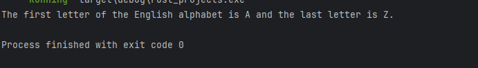

# 创建第一个Rust程序

## 1. 了解Rust程序的基本结构

### 1.1. Rust中的函数
函数就是一个**代码块**，它是用来执行一个指定功能的<br>
我们通常会将程序的代码**按照功能**拆分成多个代码块，得益于这种拆分，我们的代码会变得更加容易理解和易于维护<br>
在我们定义一个函数后，我们可以在需要执行对应功能的时候调用它

每个Rust程序都必须有一个名为`main`的函数<br>
并且`main`函数中的代码是Rust程序**最先执行的**<br>
我们可以从`main`函数中调用其他函数，也可以从其他函数中调用其它函数
```rust
fn main() {
    println!("Hello, world!");
}
```
在Rust中，我们使用`fn`关键字声明函数，在函数名后面，我们需要告知
编译器需要多少参数作为输入，这些参数会被列在`()`之间<br>
函数体是具体执行功能的代码，被定义在`{}`之间<br>
最佳做法是设置代码的格式，使函数体的左大括号紧跟在括号中的参数列表之后


### 1.2. 代码缩进
在函数体中，大多数代码语句都以`;`结尾<br>
Rust 按顺序一个接一个地处理这些语句，当代码语句不以分号结尾时，Rust 知道必须在开始语句完成之前执行下一行代码

为了帮助查看代码中的执行关系，我们使用**缩进**<br>
此格式显示代码的组织方式，并显示完成函数任务的步骤流程<br>
起始代码语句从左边距缩进四个空格，当代码不以分号结尾时，要执行的下一行代码将再缩进四个空格
```rust
fn main() { // The function declaration is not indented

    // First step in function body
        // Substep: execute before First step can be complete

    // Second step in function body
        // Substep A: execute before Second step can be complete
        // Substep B: execute before Second step can be complete
            // Sub-substep 1: execute before Substep B can be complete

    // Third step in function body, and so on...
}
```

### 1.3. todo!宏
宏在Rust当中就像一个包含多个输入参数的函数<br>
`todo!`被用于标注未完成的代码，对于整体框架原型的搭建很有帮助
```rust
fn main() {
    // Display the message "Hello, world!"
    todo!("Display the message by using the println!() macro");
}
```
在使用`todo!`进行编译的时候，编译器会返回一个`panic`信息，表明需要完整的功能实现


### 1.4. println!宏
`main`函数只做了一件事，就是调用了Rust中预定义的`println!`宏<br>
`println!`宏接收一个或多个参数进行输入，然后将其显示到屏幕上或者**标准输出**<br>
```rust
fn main() {
    // Our main function does one task: show a message
    // println! displays the input "Hello, world!" to the screen
    println!("Hello, world!");
}
```
### 1.5. {}参数的替换
在调用`println!`的时候，我们总是传入一些列参数，包括文本字符串以及一些`{}`和其他的值<br>
`println!`会使用参数列表后面的值替换字符串中的`{}`
```rust
fn main() {
    // Call println! with three arguments: a string, a value, a value
    println!("The first letter of the English alphabet is {} and the last letter is {}.", 'A', 'Z');
}
```
这里调用`println!`的时候会用到三个参数：字符串、一个值、另一个值<br>
宏按照顺序进行处理，字符串中`{}`，依次由后面的值挨个替换
