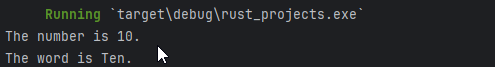
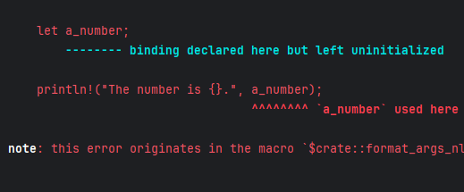
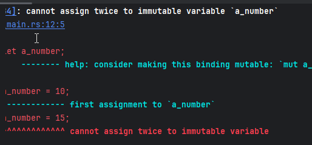
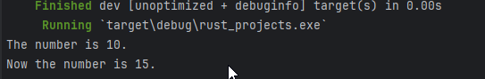

# 在Rust中创建并使用变量
开发者通过编写程序来运用数据，数据被聚集、分析、存储、处理、分享以及报告<br>
我们使用变量来存储数据，这样它便有名字可以进行引用，在接下来的代码中可以凭借名字来找到它
## 1. 变量
在Rust中，变量使用关键字`let`声明，每个变量有唯一的名字<br>
变量一旦被声明，就可以绑定到一个值上，或者稍后在程序中绑定到某个值上
```rust
let a_number;    // 声明变量
```
```rust
let a_number = 10;  // 声明并绑定
```
```rust
// Declare a variable
let a_number;

// Declare a second variable and bind the value
let a_word = "Ten";

// Bind a value to the first variable
a_number = 10;

println!("The number is {}.", a_number);
println!("The word is {}.", a_word);
```

如果在对变量赋值前调用`println!`，那么编译器将会返回错误


## 2. 可变vs不可变
在Rust中，变量的绑定的关系**默认是不可变的**<br>
值被绑定到一个不可变变量后，无法再改变这个值

如果我们试图改变变量的值，将会收到编译器的报错信息<br>
```rust
// Change the value of an immutable variable
a_number = 15;
```

大概的意思就是不可变变量无法两次赋值

为了使变量可变，我们必须先使用`mut`关键字使变量的绑定成为可变的
```rust
// The `mut` keyword lets the variable be changed
let mut a_number = 10; 
println!("The number is {}.", a_number);

// Change the value of an immutable variable
a_number = 15;
println!("Now the number is {}.", a_number);
```

现在代码编译不会有问题，因为变量现在是可变的

## 3. 变量遮蔽
你可以使用**已经存在的变量名**声明新的变量，新的声明会创建一个新的绑定关系<br>
在Rust中，这样的操作称为“遮蔽”，这是由于新的变量遮蔽了先前的变量，旧的变量依旧存在，但是你无法继续在该作用域引用它

接下来的代码揭示了遮蔽的用法
```rust
// Declare first variable binding with name "shadow_num"
let shadow_num = 5;

// Declare second variable binding, shadows existing variable "shadow_num" 
let shadow_num = shadow_num + 5; 

// Declare third variable binding, shadows second binding of variable "shadow_num"
let shadow_num = shadow_num * 2; 

println!("The number is {}.", shadow_num);
```